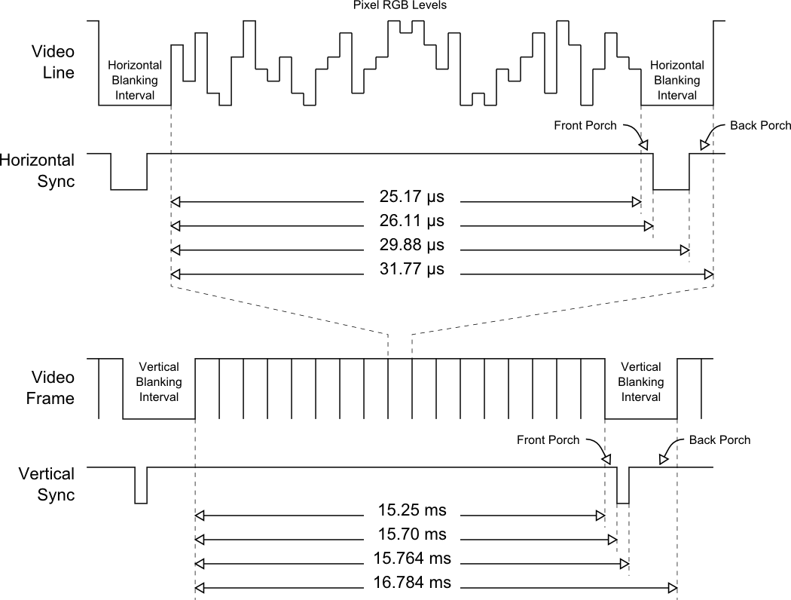
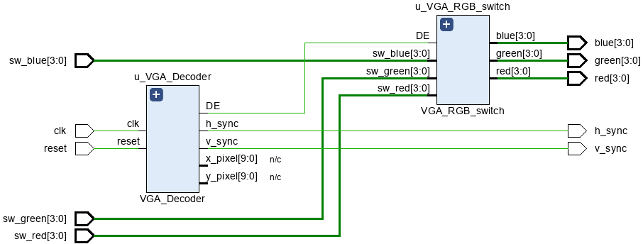

# fpga_VGA

 

## study

### Analog display VGA
**VGA는 아날로그 비디오 입출력 표준 인터페이스이며 LGB를 전압값으로 송/수신한다.**
- desplay time: 화면을 출력해 나가는 시간
- retrace time: 화면(한줄을) 표기하고 화면에 아무것도 안나오는 비는 시간(공간) => sync + porch
- porch: display전의 여유 시간(공간)(출력이 안됨)
- H-SYNC: (좌우)한줄 시작, 완료를 알리는 신호
- V-SYNC: 수직 완료, 시작 신호(화면 한 프레임 완료를 알리는것) 

 
 
 
 
 

### VGA At Digital Display
- VGA가 연결된 디지털모니터는 위의 과정을 버퍼에 넣어뒀다가 한프레임을 한번에 리프레시

### 덤
basys3 보드의 색상 채현률은 RGB 4비트씩 4096가지 색상을 표현 가능하다. 명암(색심도) 기능은 없다. 
- basys3의 DA(Digital to Analog cricuit) 
 

## develop
### vga 
 
 
 
_  _  _

#### 2025-05-28 VGA_RGB_Switch
- circuit block design 
 
- pixelCounter timing  
 
- circuit 
 

#### 2025-05-29 VGA_ROM
- rom size: QVGA(320*240)
    - VGA is too big for basys3 board 컸다.
- circuit block design 
 
- - - 
### CAM(OV7670)
 
 
 
 
 
#### 2025-05-29 VGA_CAM
- block diagram 
 
 

